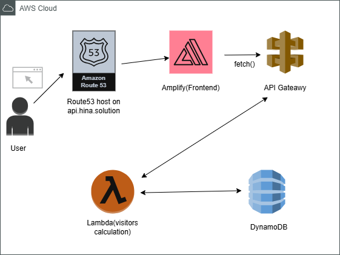

# Cloud Resume Challenge – Frontend

This is the frontend for the Cloud Resume Challenge, built with React.js and deployed via AWS Amplify.  
The site displays a visitor counter by fetching data from an API Gateway through Lambda and DynamoDB.

###  Tech Stack  
- React.js  
- AWS Amplify (Hosting)  
- Node.js  
- Custom Domain via Route 53  
---

###  Cloud Architecture Diagram  


<!-- ← update path as needed -->

---

###  How to Run Locally  

```bash
git clone https://github.com/hinait/cloud-resume-frontend.git
cd cloud-resume-frontend
npm install
npm start